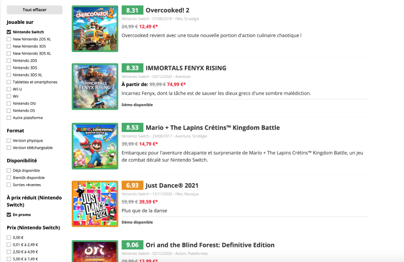

# SwitchScores browser extension

This is a browser extension for [Switch Scores](https://www.switchscores.com/). It has been tested under Chrome, Firefox and Edge.

It adds some meta-informations extracted from Switch Scores into the Nintendo game page: score, reviews, genre, series, and tags.

Now it's easier than ever to check if a heavily discounted game is shovelware or a hidden gem!

Please note that it currently only works on Nintendo Europe-based sites:

- <https://www.nintendo.co.uk/>
- <https://www.nintendo.fr/>
- <https://www.nintendo.de/>
- <https://www.nintendo.ch/>
- <https://www.nintendo.at/>
- <https://www.nintendo.be/>
- <https://www.nintendo.es/>
- <https://www.nintendo.nl/>
- <https://www.nintendo.it/>
- <https://www.nintendo.pt/>
- <https://www.nintendo.co.za/>
